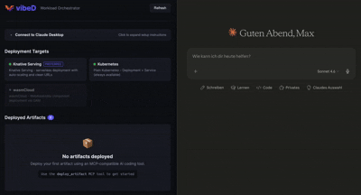

# vibeD

🚧🧪 Experimental and under construction 🧪🚧

**Workload orchestrator for GenAI-generated artifacts.**

vibeD bridges AI coding tools (Claude, Gemini, ChatGPT) with your own Kubernetes infrastructure. It exposes an [MCP server](https://modelcontextprotocol.io/) that AI tools call to deploy websites and web apps directly to your cluster — keeping code on your infrastructure, not in third-party sandboxes.



## Features

- **MCP Server** — 11 tools for deploying, updating, listing, and deleting artifacts
- **Instant static deploys** — HTML/CSS/JS files deploy in milliseconds via ConfigMap + nginx (no build step)
- **Buildah builder** — Auto-generates Dockerfiles for Node.js, Python, and Go apps; builds container images in-cluster via Kubernetes Jobs
- **Multi-target deployment** — Knative Serving (serverless), plain Kubernetes (Deployment + Service), or wasmCloud
- **Auto-detection** — Discovers available deployment targets by checking cluster CRDs
- **Web dashboard** — React UI showing all deployed artifacts with status and URLs
- **Multiple storage backends** — Local filesystem, GitHub, or GitLab
- **Per-user isolation** — Route different users to separate storage repos
- **Authentication** — API key or OAuth with optional TLS
- **Helm charts** — Production-ready deployment including RBAC, ConfigMap store, and Prometheus metrics

## Quick Start

### Prerequisites

- Go 1.23+ (with `GOTOOLCHAIN=auto`) or Go 1.25+
- A Kubernetes cluster (Kind for local dev, or any production cluster)
- Container runtime (Docker or Podman)
- kubectl configured to access your cluster

### Build

```bash
git clone https://github.com/vibed-project/vibeD.git
cd vibed
make build
```

### Run Locally (stdio)

```bash
./bin/vibed --config vibed.yaml
```

### Run with HTTP Transport (dashboard + MCP endpoint)

```bash
./bin/vibed --config vibed.yaml --transport http
# Dashboard: http://localhost:8080
# MCP endpoint: http://localhost:8080/mcp/
```

### Deploy to a Kind Cluster

```bash
# Create Kind cluster + install Knative + build vibeD
make dev

# Build container image and load into Kind
make load-image

# Install with Helm
helm install vibed deploy/helm/vibed/ \
  --namespace vibed-system \
  --create-namespace

# Port-forward to access vibeD
kubectl port-forward svc/vibed 8080:8080 -n vibed-system

# Port-forward to access deployed artifacts
kubectl port-forward svc/kourier 8081:80 -n kourier-system
```

Deployed artifacts are accessible at `http://<name>.default.127.0.0.1.sslip.io:8081`.

## Connect to Claude Desktop

### Option A: Stdio (vibeD runs locally)

Add to `~/Library/Application Support/Claude/claude_desktop_config.json`:

```json
{
  "mcpServers": {
    "vibed": {
      "command": "/path/to/vibed",
      "args": ["--config", "/path/to/vibed.yaml"]
    }
  }
}
```

### Option B: HTTP (vibeD runs in-cluster)

With vibeD deployed to your cluster and port-forwarded to `localhost:8080`:

```json
{
  "mcpServers": {
    "vibed": {
      "command": "npx",
      "args": ["mcp-remote", "http://localhost:8080/mcp/"]
    }
  }
}
```

Then ask Claude: *"Create a simple portfolio website and deploy it using vibeD"*

## MCP Tools

| Tool | Description |
|------|-------------|
| `deploy_artifact` | Deploy source files as a web artifact |
| `update_artifact` | Update an existing artifact with new files |
| `list_artifacts` | List all deployed artifacts with status |
| `get_artifact_status` | Get detailed status for one artifact |
| `get_artifact_logs` | Retrieve pod logs for debugging |
| `delete_artifact` | Stop and remove an artifact |
| `list_deployment_targets` | Show available deployment backends |

## How It Works

```
AI Tool (Claude, Gemini, etc.)
    │
    │  MCP Protocol (deploy_artifact)
    ▼
┌─────────┐
│  vibeD   │  MCP Server + Dashboard
└────┬─────┘
     │
     ├── Static HTML/CSS/JS? → ConfigMap + nginx:alpine (instant)
     │
     └── App code? → Buildah Job → Container Image
                                        │
                     ┌──────────────────┤
                     ▼                  ▼
               Knative Serving    Kubernetes Deployment
               (serverless)       (always available)
```

**Static files** (HTML, CSS, JS under 900KB) are stored in a Kubernetes ConfigMap and served by nginx — no container build, deploys in milliseconds.

**Application code** (Node.js, Python, Go) gets an auto-generated Dockerfile, built into a container image by a Buildah Kubernetes Job, and deployed to the selected target.

## Configuration

vibeD is configured via `vibed.yaml`. Key sections:

```yaml
server:
  transport: "http"        # stdio | http | both
  httpAddr: ":8080"

deployment:
  preferredTarget: "auto"  # auto | knative | kubernetes | wasmcloud
  namespace: "default"

builder:
  engine: "buildah"
  buildah:
    image: "quay.io/buildah/stable:latest"
    timeout: "10m"

storage:
  backend: "local"         # local | github | gitlab

store:
  backend: "memory"        # memory | configmap

knative:
  domainSuffix: "127.0.0.1.sslip.io"
```

Every field has an environment variable override (e.g. `VIBED_SERVER_TRANSPORT`). See [Configuration Reference](docs/docs/configuration/config-reference.md) for the full list.

## Project Structure

```
cmd/vibed/          Main entry point
internal/
  builder/          Buildah builder + Dockerfile generation
  config/           Configuration loading
  deployer/         Knative, Kubernetes, wasmCloud deployers
  orchestrator/     Deploy/update/delete lifecycle coordination
  store/            Artifact metadata (memory, ConfigMap)
  storage/          Source file storage (local, GitHub, GitLab)
  frontend/         Dashboard (embedded React SPA)
  metrics/          Prometheus metrics
  auth/             API key + OAuth authentication
pkg/api/            Shared types
deploy/helm/        Helm charts
docs/               Docusaurus documentation site
web/                React dashboard source
```

## Development

```bash
make build          # Build Go binary
make run-http       # Build and run with HTTP transport
make test           # Run unit tests
make lint           # Run linter
make web-build      # Build React dashboard
make build-all      # Build frontend + backend
make dev            # Full local setup (Kind + Knative + build)
make teardown       # Delete Kind cluster
```

## Documentation

Full documentation is available in the `docs/` directory (Docusaurus site):

```bash
make docs-install   # Install doc dependencies
make docs-dev       # Start docs dev server
```

## License

Apache License 2.0 — see [LICENSE](LICENSE).
