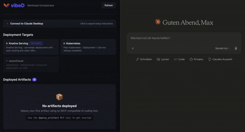

# vibeD

🚧🧪 Experimental and under construction 🧪🚧

**Workload orchestrator for GenAI-generated artifacts.**

vibeD bridges AI coding tools (Claude, Gemini, ChatGPT) with your own Kubernetes infrastructure. It exposes an [MCP server](https://modelcontextprotocol.io/) that AI tools call to deploy websites and web apps directly to your cluster — getting AI-generated code to a live URL in **seconds**, with hardware-grade isolation, and **without building a container on the deploy path**.



## Features

- **MCP Server** — 18 tools for deploying, updating, listing, rolling back, sharing, and deleting artifacts, plus user/department management
- **No build on the deploy path** — source is injected into a pre-booted, warm sandbox; template images are built by CI on template changes, never per deploy
- **Two lanes, auto-selected** — a deterministic classifier inspects file names and routes each upload to the **fast lane** (workerd V8 isolates or static nginx) or the **general lane** (Kata + Firecracker microVM for arbitrary Node/Python/Go/any-image code)
- **Built on agent-sandbox** — reuses [kubernetes-sigs/agent-sandbox](https://github.com/kubernetes-sigs/agent-sandbox) (`Sandbox`, `SandboxTemplate`, `SandboxClaim`, `SandboxWarmPool`); vibeD adds one CRD, `VibedApp`
- **Warm pools** — pre-booted idle sandboxes per template, so a deploy never waits on a cold boot or an image build
- **Caddy routing** — vibed-router programs Caddy routes per app; wildcard DNS-01 TLS in production, plain HTTP in dev
- **Web dashboard** — React UI showing all deployed artifacts with status and URLs
- **Multiple storage backends** — local filesystem, GitHub, or GitLab for source files; S3/MinIO or in-cluster served blobs for the source tarball store
- **Per-user isolation** — route different users to separate storage repos
- **Authentication** — API key or OIDC, with optional TLS
- **Helm charts** — production-ready deployment including RBAC, the control plane, warm pools, and Prometheus metrics

## Quick Start

### Prerequisites

- Go 1.23+ (with `GOTOOLCHAIN=auto`) or Go 1.25+
- A Kubernetes cluster — Kind for local dev (`make dev` sets it up), or any 1.29+ cluster for production
- Container runtime (Podman or Docker)
- kubectl configured to access your cluster

For production you also need [agent-sandbox](https://github.com/kubernetes-sigs/agent-sandbox) (v0.4.5+), a Kata RuntimeClass (`kata-qemu` or `kata-fc`), a sandbox node pool, and object storage — see the [installation guide](docs/docs/getting-started/installation.md).

### Build

```bash
git clone https://github.com/vibed-project/vibeD.git
cd vibed
make build
```

### Run Locally (stdio)

```bash
./bin/vibed --config vibed.yaml
```

### Run with HTTP Transport (dashboard + MCP endpoint)

```bash
./bin/vibed --config vibed.yaml --transport http
# Dashboard: http://localhost:8080
# MCP endpoint: http://localhost:8080/mcp
```

### Local Cluster (Kind)

```bash
# Stands up a Kind cluster, installs agent-sandbox + the testbed,
# builds and loads the vibed/controller/router/static-nginx images,
# and helm-installs vibeD with the dev overlay.
make dev
```

When it finishes, the dashboard is at `http://localhost:8080/` and deployed apps are reachable at `http://<id>.localhost/` — no `kubectl port-forward` needed (Kind's `extraPortMappings` bridge the host ports). The dev install enables only the `static-nginx` warm pool; enable others with `make enable-python-pool` / `make enable-node-pool`. See [Local development](docs/docs/getting-started/local-dev.md) for details.

## Connect to Claude Desktop

### Option A: Stdio (vibeD runs locally)

Add to `~/Library/Application Support/Claude/claude_desktop_config.json`:

```json
{
  "mcpServers": {
    "vibed": {
      "command": "/path/to/vibed",
      "args": ["--config", "/path/to/vibed.yaml"]
    }
  }
}
```

### Option B: HTTP (vibeD runs in-cluster)

With vibeD deployed and reachable at `localhost:8080`:

```json
{
  "mcpServers": {
    "vibed": {
      "command": "npx",
      "args": ["mcp-remote", "http://localhost:8080/mcp"]
    }
  }
}
```

Then ask Claude: *"Create a simple portfolio website and deploy it using vibeD"*

## MCP Tools

vibeD exposes 18 MCP tools. The core deploy lifecycle:

| Tool | Description |
|------|-------------|
| `deploy_artifact` | Deploy source files as a web artifact |
| `update_artifact` | Update an existing artifact with new files |
| `list_artifacts` | List all deployed artifacts with status |
| `get_artifact_status` | Get detailed status for one artifact |
| `get_artifact_logs` | Retrieve pod logs for debugging |
| `list_versions` | List the version history of an artifact |
| `rollback_artifact` | Roll an artifact back to a previous version |
| `delete_artifact` | Stop and remove an artifact |

Plus `list_deployment_targets`, sharing (`share_artifact`, `unshare_artifact`,
and the share-link tools), and user/department management — see the
[docs](https://vibed-project.github.io/vibeD/docs/mcp-tools/overview).

## How It Works

```
AI Tool (Claude, Gemini, ChatGPT)
    │
    │  MCP / REST  →  deploy_artifact (gzipped source tarball)
    ▼
┌──────────────┐
│    vibed     │  HTTP server · MCP · dashboard
└──────┬───────┘
       │  1. classify source by file names → (lane, template)
       │  2. store the source blob (s3 in prod, served in dev)
       │  3. create a VibedApp CR
       ▼
┌──────────────────┐
│ vibed-controller │  claims a pre-booted sandbox from the matching warm
└──────┬───────────┘  pool, then POSTs the source URL to its vibed-agent
       │
       ▼  vibed-agent (PID 1 in the sandbox) pulls + extracts + starts the app
┌────────────────────────────┬──────────────────────────────────┐
│  fast lane                 │  general lane                     │
│  workerd V8 isolates       │  Kata + Firecracker microVM       │
│  or static-nginx           │  (Node, Python, Go, any image)    │
└────────────────────────────┴──────────────────────────────────┘
       │
       ▼  per-app Service (follows the pod, so the route never goes stale)
┌──────────────┐
│ vibed-router │  watches VibedApp status, programs Caddy routes
└──────┬───────┘
       ▼
   Caddy reverse proxy  →  https://<id>.<domain>
```

**The deploy path never builds an image.** A deterministic [classifier](docs/docs/concepts/lanes-and-templates.md) reads only file *names* + `package.json` keys (well under 50 ms) and picks a `(lane, template)`. The controller claims a warm, pre-booted sandbox, and `vibed-agent` injects the source into `/workspace` and starts the process. If everything is warm this completes in seconds.

**Fast lane** — static sites (HTML/CSS/JS, served by an nginx sandbox) and small trusted-language workers (workerd V8 isolates). Sub-second cold start.

**General lane** — arbitrary code (Node.js, Python, Go, or any base image) runs in a Kata + Firecracker microVM for hardware-grade isolation. New runtime/dependency combinations are handled by an async template builder that refreshes the warm pool out of band — never on the deploy path.

For the full picture see the [architecture docs](docs/docs/concepts/architecture.md).

## Configuration

vibeD has two layers: the app config (`vibed.yaml`, rendered into a ConfigMap by the chart) and the Helm values (cluster topology). Key app-config sections:

```yaml
server:
  transport: "http"            # stdio | http
  httpAddr: ":8080"

auth:
  enabled: false               # enable before exposing the API
  mode: "apikey"               # apikey | oidc

deployment:
  appsNamespace: "vibed-apps"  # where /v1 creates VibedApps + warm pools live
  readyTimeout: "10m"          # how long a deploy waits for Ready before failing

storage:
  backend: "local"             # local | github | gitlab  (source files)
  tarball:
    backend: "served"          # served (DEV only) | s3 (PRODUCTION)

store:
  backend: "sqlite"            # sqlite | configmap | memory
```

Most fields have an environment override (e.g. `VIBED_SERVER_TRANSPORT`). Cluster topology — namespaces, the Kata RuntimeClass, NetworkPolicy, controller/router/Caddy, and the warm pools — is set through Helm values. See the [Configuration Reference](docs/docs/configuration/config-reference.md) for the full list.

## Project Structure

```
cmd/
  vibed/              HTTP server, MCP, dashboard, classifier
  vibed-controller/   VibedApp reconciler (claims sandboxes, injects source)
  vibed-router/       Programs Caddy routes from VibedApp status
  vibed-agent/        PID 1 inside every sandbox (pulls + starts the app)
  vibed-egress-authz/ Per-connection egress authorizer for the Squid forward proxy
  vibed-workerd-loader/ Fast-lane workerd sidecar that loads workers into the V8 runtime
internal/
  classifier/         Deterministic lane + template selection
  controller/         Reconcile logic for VibedApp
  router/             Caddy route programming
  deployer/           Kubernetes + sandbox deployers
  orchestrator/       Deploy/update/delete lifecycle coordination
  prebaked/           Pre-baked-dependency fast path
  tarball/ storage/   Source blob + source-file storage backends
  store/              Artifact metadata (sqlite, ConfigMap)
  frontend/           Dashboard (embedded React SPA)
  auth/ metrics/ ...  Auth, Prometheus metrics, GC, quota, tracing
pkg/api/              Shared types
deploy/helm/          Helm charts (control plane + warm pools)
templates/            SandboxTemplate / SandboxWarmPool definitions
docs/                 Docusaurus documentation site
web/                  React dashboard source
```

## Development

```bash
make build          # Build the vibed binary
make build-all      # Build frontend + backend
make run-http       # Build and run with HTTP transport
make test           # Run unit tests
make e2e            # Run end-to-end tests
make lint           # Run linter
make web-build      # Build React dashboard
make dev            # Full local setup (Kind + agent-sandbox + build + install)
make teardown       # Delete the Kind cluster
```

## Documentation

Full documentation is available in the `docs/` directory (Docusaurus site):

```bash
make docs-install   # Install doc dependencies
make docs-dev       # Start docs dev server
```

## Extending vibeD

vibeD's control plane is assembled from **registries**: storage, authentication, tenancy, deploy-time policy, usage metering, and secret schemes are all looked up at startup by name. You can supply your own implementation of any of them from a **separate, out-of-tree Go module** — no fork, no patch, no rebuild of the core.

The seam is the public [`pkg/plugin`](https://pkg.go.dev/github.com/vibed-project/vibeD/pkg/plugin) package plus the reusable [`pkg/server`](https://pkg.go.dev/github.com/vibed-project/vibeD/pkg/server) entry point. `pkg/plugin` re-exports the internal registry interfaces as **type aliases**, so a value in your module that satisfies `plugin.ArtifactStore` is the same type the core expects — no adapter needed. (Go forbids importing another module's `internal/` packages, which is why the aliases exist.)

| Extension point | Register with | Selected by |
|-----------------|---------------|-------------|
| Store backends (`ArtifactStore`, `UserStore`, `AuditStore`, `ShareLinkStore`) | `RegisterStoreBackend(name, factory)` | `store.backend` |
| Auth providers (`TokenVerifier` + login `Route`s) | `RegisterAuthProvider(mode, factory)` | `auth.mode` |
| Tenancy (`TenantResolver`) | `RegisterTenantResolver(factory)` | — |
| Deploy-time policy (`PolicyGate`) | `RegisterPolicyGate(factory)` | — |
| Usage metering (`MeterSink`) | `RegisterMeterSink(factory)` | — |
| Secret schemes (`SecretSchemeResolver`) | `RegisterSecretScheme(scheme, resolver)` | `<scheme>:<ref>` |

The pattern is always the same: your provider package's `init()` calls the matching `plugin.Register…` function, your `main.go` blank-imports that package and calls `server.Main()`, and vibeD picks up your provider through the ordinary `vibed.yaml` config keys. Gated features are controlled by an editions/feature-flag seam (`Entitlements`) whose default enables every feature.

See [Extending vibeD](https://vibed-project.github.io/vibeD/docs/extending/overview) for full guides on each extension point.

## License

Apache License 2.0 — see [LICENSE](LICENSE).
