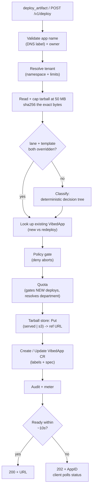

# The deploy pipeline

A deploy turns an uploaded source tarball into a running URL. This page walks the
whole path — from the request to the point where the client gets a URL back —
through the `vibed` control plane. Everything here happens in `internal/deploy`;
the HTTP handler and the MCP `deploy_artifact` tool are thin wrappers that call the
same `Deploy` service.

The single most important property: **there is no container build on the deploy
path.** vibeD never runs `docker build`, `buildah`, or an image push. The
classifier picks a pre-built template, the controller claims a matching warm
sandbox, and [`vibed-agent`](architecture.md) pulls the source into it. That is
what keeps a deploy in the seconds, not minutes, range.

## Two entry points, one service

| Entry point | Transport |
| --- | --- |
| `deploy_artifact` | MCP tool (Claude Desktop, Cursor, Goose, any MCP client) |
| `POST /v1/deploy` | HTTP multipart (source tarball + metadata) |

Both build a `deploy.Request` and call `Service.Deploy`. The request carries the
app `Name`, `Owner`, the gzipped source `Tarball`, and optional overrides:
`LaneOverride`, `TemplateOverride`, `Entrypoint`, `Env`, `TTL`, and `AllowedHosts`
(the per-app egress allow-list; empty means no external egress).

## The pipeline, end to end



The steps below follow `Service.Deploy` in order.

### 1. Validate the app name and owner

`Name` must be a DNS label — `^[a-z0-9]([a-z0-9-]*[a-z0-9])?$` — because it becomes
the `VibedApp` object name and part of the app URL. `Owner` is required. Both are
rejected before any bytes are read.

### 2. Resolve the tenant

The request is resolved to a tenant (a namespace plus per-tenant limits). With no
resolver configured, vibeD runs single-tenant: every request uses the server's
default namespace (`vibed-apps`) with no per-tenant limits. A *named* tenant must
carry its own namespace — vibeD refuses to fall back to the shared default, so one
tenant's apps never silently land next to another's.

### 3. Read, cap, and hash the source

The tarball is read exactly once and capped at **50 MB** (`MaxTarballBytes`); an
empty upload is rejected too. The same in-memory bytes are then reused for the
classifier and the store — the source is never read twice.

vibeD computes a **sha256** of those exact bytes and attaches it to this deploy's
audit context as the source provenance hash, so every audit event for the deploy
records precisely which source produced it.

### 4. Classify — the deterministic decision tree

If **both** `LaneOverride` and `TemplateOverride` are set, the classifier is
skipped entirely. Otherwise the classifier runs and fills in whichever field the
caller left empty (an override always wins over the classifier's choice for that
field).

The classifier is deterministic and does not build, install, or execute anything.
It streams the gzipped tarball, reads **file names** (plus a few top-level keys of a
root `package.json`), and applies a **9-rule decision tree — first match wins**. It
must not buffer the whole archive and is bounded by the same 50 MB limit.

The rules, in the priority order they are evaluated:

| # | Rule | Trigger (at tarball root unless noted) | Lane | Template |
| --- | --- | --- | --- | --- |
| 4 | Spin | `spin.toml` | `fast` | `spin` |
| 3 | workerd | `wrangler.toml`, `worker.js`, or `worker.ts` | `fast` | `workerd` |
| 2 | Browser bundle | `package.json` with a `build` script that looks like an SPA bundler (output `dist/`/`build/`, or vite/parcel/webpack/rollup/esbuild/`@angular/cli` dep) | `fast` | `static-nginx` |
| 5 | Node with deps | any other root `package.json` | `general` | `node-24` |
| 6 | Python | `requirements.txt` or `pyproject.toml` | `general` | `python-313` |
| 7 | Go | `go.mod` | `general` | `go-123` |
| 8 | Dockerfile | `Dockerfile` (used as a runtime hint — **not built**) | `general` | `base-al2023` |
| 1 | Static only | only static asset extensions anywhere, at least one `.html`, and no server-signal marker | `fast` | `static-nginx` |
| 9 | Fallback | unknown shape | `general` | `base-al2023` |

A few things worth calling out:

- The numbering is the stable **rule ID** surfaced on the decision (for logging and
  support — "why did vibeD pick `python-313`?"), not the evaluation order. The table
  is listed top-to-bottom in the order the tree actually checks.
- **Rule 1 (static only) is checked late**, after the marker rules, so a
  `package.json` sitting next to `index.html` still routes as Node (rule 5), not as
  a static site.
- **Rule 8 does not build the Dockerfile.** It is only a signal that the app is
  container-shaped; `base-al2023` carries a kitchen-sink toolchain so the agent can
  find and run the start command.
- **Rule 2 sets `BuildAsync`.** A browser SPA's long-term home is `static-nginx`,
  but the bundle is not built yet, so an async build is scheduled alongside a
  short-term fast-lane stub.
- Server-signal markers (`Dockerfile`, `go.mod`, `requirements.txt`,
  `pyproject.toml`, `package.json`, `spin.toml`, `wrangler.toml`, `worker.js`,
  `worker.ts`) anywhere in the tree disqualify the static-only rule.

See [Lanes & templates](lanes-and-templates.md) for what each lane and template
runs.

### 5. New vs redeploy

vibeD looks up an existing `VibedApp` with the same name in the tenant's namespace.
If none exists this is a **new** deploy; if one exists it is a **redeploy**, which
reuses the same CR (so the controller can snapshot/restore later) and is **not**
quota-gated.

### 6. Policy gate

If a policy gate is configured, it is evaluated on **every** deploy — new *and*
redeploy, since a redeploy can introduce a new violation — after classification and
before anything is stored. The gate sees the tenant, owner, name, resolved
lane/template, `AllowedHosts`, `Env`, the new-vs-redeploy flag, and the raw source.
A denial is audited as `denied` and aborts the deploy.

### 7. Quota

If a quota enforcer is configured, it gates **new** deploys against the tenant's
ceilings and resolves the owner's department (used for labeling). A quota rejection
is audited as `denied` and aborts the deploy. Redeploys skip this step.

### 8. Store the tarball

The source is written to the tarball store, which returns a **reference URL** the
in-sandbox agent will pull from. There are two backends:

| Backend | Where it stores | When |
| --- | --- | --- |
| `served` | vibeD's own PVC, served over the in-cluster Service URL | **dev only** |
| `s3` | S3 / MinIO, handed to the agent as a pre-signed URL | **production** |

`served` requires the sandbox to reach vibeD over cluster DNS. Once a restrictive
sandbox NetworkPolicy is in place (production), sandboxes have no cluster DNS or
cluster-internal egress, so the agent can only pull from a pre-signed `s3` URL. See
[Storage](../configuration/storage.md) and the
[`storage.tarball` config](../configuration/config-reference.md).

If the store write fails, the deploy is audited as `error` and aborted before any
CR is touched.

### 9. Create or update the `VibedApp` CR

vibeD assembles the labels and spec, then either creates a new `VibedApp` or updates
the existing one.

**Labels** (each value sanitized to be label-safe):

| Label | Value |
| --- | --- |
| `vibed.dev/owner` | the request owner |
| `vibed.dev/department` | the owner's department (only when quota resolved one) |
| `vibed.dev/tenant` | the tenant ID (only when running multi-tenant) |

**Spec** (`VibedAppSpec`):

```yaml
owner: <request owner>
source:
  tarballRef: <store reference URL>   # the pre-signed / in-cluster URL the agent pulls
runtime:
  lane: <fast | general>              # override or classifier result
  template: <template>                # override or classifier result
  entrypoint: <optional>              # empty -> agent autodetect
  env: [...]                          # optional
egress:
  allowedHosts: [...]                 # per-app egress allow-list; empty -> no external egress
ttl: <optional>
```

On a **new** deploy vibeD creates the CR; if the create fails it deletes the just-
stored blob so no orphan is left behind. On a **redeploy** it overwrites the spec and
merges the labels into the existing object.

From here the [`vibed-controller`](app-lifecycle.md) takes over: it reconciles the
`VibedApp` into an agent-sandbox claim, the agent pulls the source, and
[`vibed-router`](architecture.md) programs the Caddy route.

### 10. Audit and meter

On success, vibeD records a `deploy` / `ok` audit event and a usage event
(tenant, owner, app, namespace). If the auditor is **fail-closed** and the audit
write fails, the API surfaces the error even though the CR already exists — the
caller is told the action could not be durably recorded and should retry (deploy is
idempotent) or alert an operator. See [Audit log](../configuration/audit-log.md).

### 11. Wait for ready, or 202

vibeD then polls the CR's status for up to **~10s** (`DeployTimeout`, re-reading
roughly every 250 ms):

- **`Ready`** → return the app ID, phase, and URL. The API responds `200`.
- **`Failed`** → return the app ID and phase (no URL, `Ready: false`).
- **Timeout** → the sandbox is still being claimed; vibeD returns the current phase
  with `Ready: false`. The API turns this into a **`202`**, and the client polls the
  app's status until it goes `Ready`.

A timeout is **not** an error — it is the normal 202 path for a deploy that needs a
little longer to claim and warm its sandbox. The overall ceiling before a deploy is
considered failed is `deployment.readyTimeout` in the
[config](../configuration/config-reference.md).

## What this deliberately does not do

- **No image build.** No `docker build`, `buildah`, or push. The classifier selects
  a pre-built template and the controller claims a warm sandbox.
- **No code execution during classify.** The classifier only reads file names and a
  bounded slice of a root `package.json` — it never runs user code.
- **No double-read of the source.** The tarball is read and capped once; those bytes
  feed both the classifier and the store.

## Related

- [Architecture](architecture.md) — the six binaries and how they fit together.
- [App lifecycle](app-lifecycle.md) — what the controller does with the `VibedApp`.
- [Lanes & templates](lanes-and-templates.md) — the runtimes behind each template.
- [The `deploy_artifact` tool](../mcp-tools/deploy-artifact.md) — the MCP entry point.
- [Storage](../configuration/storage.md) — the `served` vs `s3` tarball backends.
